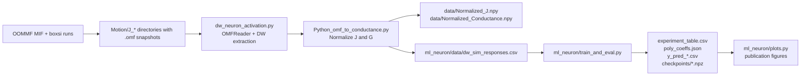
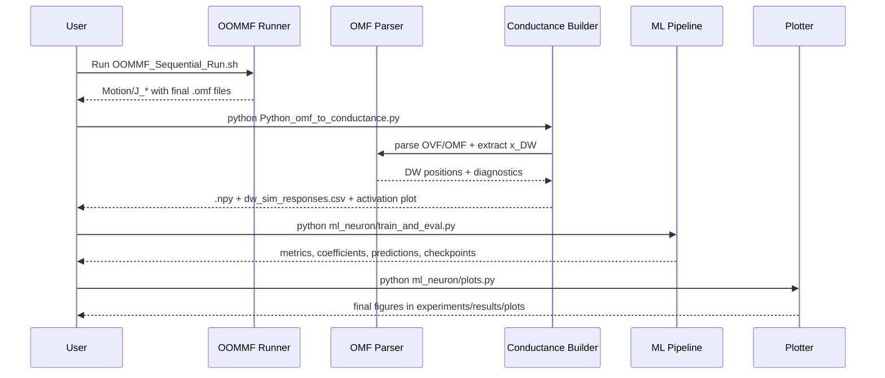

# Domain-Wall Neuron: OOMMF to ML Pipeline

[](requirements.txt)
[](https://math.nist.gov/oommf/)
[](ml_neuron/tests)
[](ml_neuron/quant.py)

End-to-end research codebase that maps micromagnetic domain-wall dynamics to a neural activation pipeline.
It runs OOMMF simulations, extracts domain-wall positions from OVF/OMF files, converts them to normalized conductance, and evaluates FP32/INT8/polynomial-neuron variants.

## Table of Contents
- [Overview](#overview)
- [Architecture](#architecture)
- [Repository Map](#repository-map)
- [Physics Model](#physics-model)
- [Quick Start](#quick-start)
- [Detailed Workflow](#detailed-workflow)
- [Module Reference](#module-reference)
- [Outputs](#outputs)
- [Testing](#testing)
- [Notes and Recommendations](#notes-and-recommendations)

## Overview

### Objective
Build and validate a physically grounded neuron activation:

$$ J \rightarrow x_{DW}(J) \rightarrow G(x_{DW}) \rightarrow \hat{y} $$

Where:
- $J$ is spin current density
- $x_{DW}$ is extracted domain-wall position
- $G$ is normalized conductance (with optional leaky behavior)
- $\hat{y}$ is ML model output

### What this repository includes
- OOMMF simulation runner across current densities (`OOMMF_Sequential_Run.sh`)
- OVF/OMF parser + DW extraction utilities (`dw_neuron_activation.py`)
- Conductance curve generation and export (`Python_omf_to_conductance.py`)
- Numpy-based ML experiments (`ml_neuron/`)
- INT8 quantization and polynomial activation studies
- Plot generation and experiment report artifacts

## Architecture



## Repository Map

```text
.
├── OOMMF_Sequential_Run.sh
├── Python_omf_to_conductance.py
├── dw_neuron_activation.py
├── Readme.md
├── requirements.txt
├── DW_Creation/
│   ├── DW_creation.mif
│   └── python_omf_to_png_ORIGINAL.py
├── Motion/
│   └── J_*e10/
├── data/
│   ├── Normalized_J.npy
│   └── Normalized_Conductance.npy
└── ml_neuron/
    ├── data_prep.py
    ├── neuron_fp32.py
    ├── quant.py
    ├── relu_poly.py
    ├── train_and_eval.py
    ├── plots.py
    ├── metrics.py
    ├── run_experiments.sh
    ├── tests/
    └── experiments/results/
```

## Physics Model

### Device and material parameters
- Track length: 512 nm
- Track width: 64 nm
- Thickness: 2 nm
- Exchange stiffness $A = 15$ pJ/m
- DMI constant $D = 2.0$ mJ/m$^2$
- Saturation magnetization $M_s = 1.1$ MA/m
- Uniaxial anisotropy $K_u = 1.0$ MJ/m$^3$

### Conductance mapping
A bounded linear map is used in the extraction stage:

$$
G_{\text{raw}} = G_{\text{min}} + (G_{\text{max}} - G_{\text{min}}) \cdot \text{clip}\left(\frac{x_{\text{DW}}}{L}, 0, 1\right)
$$

Optional circuit-level leaky behavior:

$$
G = \begin{cases} 
G_{\text{raw}}, & \text{if } J > 0 \\\\ 
\alpha G_{\text{raw}}, & \text{if } J \le 0 
\end{cases}
$$

## Quick Start

### 1) Install dependencies
```bash
python3 -m venv .venv
source .venv/bin/activate
pip install -r requirements.txt
pip install -r ml_neuron/requirements.txt
```

### 2) Run OOMMF sweep
```bash
export OOMMF_TCL_PATH=/path/to/oommf/oommf.tcl
export OOMMF_THREADS=8
bash OOMMF_Sequential_Run.sh
```

### 3) Build conductance data
```bash
python Python_omf_to_conductance.py
```

### 4) Run ML experiments and plots
```bash
cd ml_neuron
python train_and_eval.py
python plots.py
```

## Detailed Workflow



## Module Reference

- `dw_neuron_activation.py`
  - OVF/OMF parsing (`OMFReader`, `OMFData`)
  - DW position extraction
  - Conductance mapping and batch processing

- `Python_omf_to_conductance.py`
  - scans `Motion/J_*e10/`
  - computes normalized $J$ and $G$
  - exports `.npy` arrays and ML CSV

- `ml_neuron/neuron_fp32.py`
  - `SingleNeuron`, `TinyMLP`, activation classes

- `ml_neuron/quant.py`
  - symmetric INT8 quantization helpers
  - quantized model wrapper

- `ml_neuron/relu_poly.py`
  - polynomial fitting for ReLU / Leaky-ReLU
  - Horner evaluation and error analysis

- `ml_neuron/train_and_eval.py`
  - runs FP32, INT8, and polynomial experiment matrix

- `ml_neuron/plots.py`
  - generates all publication-style figures

## Outputs

Primary artifacts:
- `data/Normalized_J.npy`
- `data/Normalized_Conductance.npy`
- `ml_neuron/data/dw_sim_responses.csv`
- `ml_neuron/experiments/results/experiment_table.csv`
- `ml_neuron/experiments/results/poly_coeffs.json`
- `ml_neuron/experiments/results/y_pred_*.csv`
- `ml_neuron/experiments/results/plots/*.png`

## Testing

```bash
cd ml_neuron
pytest tests/ -v
```

Current test suite:
- `test_quant.py`
- `test_poly_fit.py`

## Notes and Recommendations

- `ml_neuron/run_experiments.sh` currently runs `data_prep.py` first; this may regenerate synthetic data if real OOMMF CSV inputs are not configured. For real OOMMF-derived training, run the root extraction script before ML training.
- Keep OOMMF output folder names in `Motion/J_*e10/` format so auto-discovery stays deterministic.
- For polynomial activations in hardware, clamp inputs to the fitting range to avoid out-of-range extrapolation errors.
